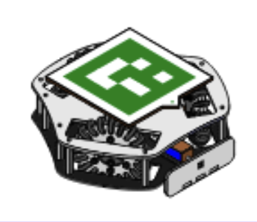
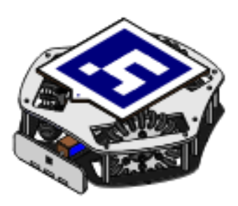
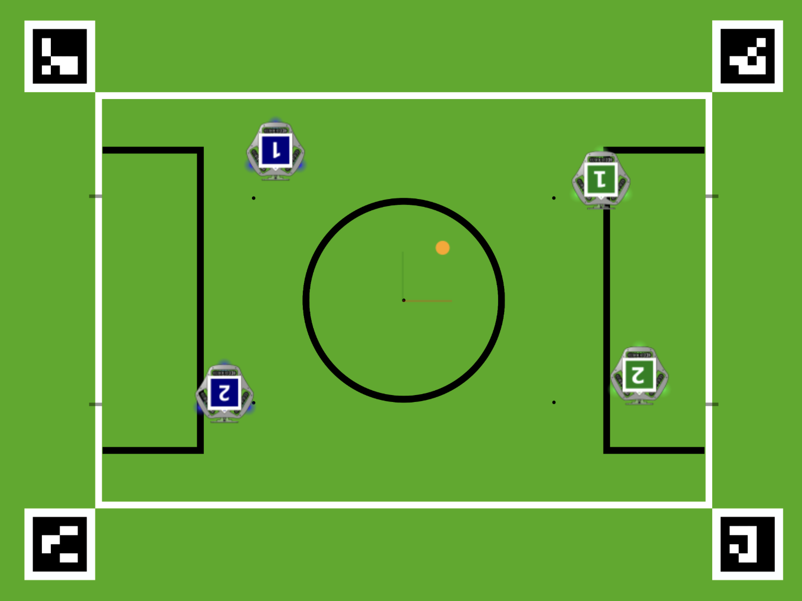

<h1 style="
  display: flex;
  align-items: center;
  justify-content: center;
  gap: 12px;
">
  
  <span>Neural Dynamics Simulator for RSK</span>
  
</h1>

**Description:** This project explores the replacement of an analytical dynamics simulator of the Robot Soccer Kit (https://robot-soccer-kit.github.io/) by a learning-based neural simulator trained from real-world data. The goal is to reduce the sim-to-real gap.


 

[User documentation](docs/user/README.md) • [Developer documentation](docs/developer/README.md) • [Project report](docs/report/README.md) • [Bibliography](docs/bibliography/README.md) 
  
## This project in short


* **Context & intented users**

This project is developed in an academic context around the Robot Soccer Kit (RSK)
(https://robot-soccer-kit.github.io/), an open robotics platform created by the
Rhoban laboratory.

It was developed at the request of the Rhoban laboratory for academic and
research purposes, and targets students and researchers interested in robotics
simulation and sim-to-real approaches.

* **Motivation**: why this project exists

To obtain strong game strategies for the Robot Soccer Kit, we ultimately want to learn control policies with Reinforcement Learning (RL). This typically requires running **thousands to millions of simulated matches** to explore strategies safely and efficiently. However, the current analytical simulator exhibits a **sim-to-real gap**: policies that perform well in simulation often fail to transfer to real RSK robots because the simulated dynamics do not match real-world motion closely enough.


This project addresses that bottleneck by introducing a learning-based (neural) dynamics simulator aimed at reducing the **sim-to-real gap** and enabling practical RL training with reliable real-world transfer.

* **Approach**: how it addresses the sim-to-real gap

We train a neural dynamics model directly from real robot trajectories collected on physical RSK robots. The learned model is then integrated into the existing RSK simulation pipeline as a drop-in, data-driven alternative to purely analytical motion simulation, while preserving compatibility with the original RSK software stack.

The goal is to provide a simulator in which RL-trained policies are exposed to dynamics closer to reality, improving their chances of being transferred to real robots with minimal additional tuning.

* **Current Limitations**

This project's current version does not provide a complete replacement for the analytical simulator. Robot–robot collisions are not modeled, ball dynamics are not learned. 

These limitations may affect policy transfer in scenarios involving frequent contacts or complex multi-agent interactions.


## Quickstart 
The following steps allow you to install and run the Robot Soccer Kit simulator with the neural dynamics model enabled.
* **Installation instructions**: 

Setting your virtual environement
```bash
# From the root of the repository
python -m venv venv
```
Activate the environement
```bash
# Linux / macOS
source venv/bin/activate
# Windows
.\venv\Scripts\Activate.ps1
```
Install dependecies 
```bash
pip install -e src/robot-soccer-kit[gc]
pip install -e src/rsk-neural-simulator
```


* **Launch instructions**: 

Launch the simulated Robot-Soccer-Kit game controller powered by a pre-trained neural network
```bash
# From the root of the repository
game_controller --simulated
```
For more advice about Robot-Soccer-Kit codebase, please refer to the original documentation : 

https://robot-soccer-kit.github.io/documentation

## About this project

| **Client**          | Rhoban (https://www.rhoban.com/fr)                                     |
|:------------------:|:------------------------------------------------------------------------:|
| **Confidentiality**| **Public**                                                              |
| **License**        | Creative Commons Attribution–NonCommercial 2.0 Generic (CC BY-NC 2.0)   |
| **Authors**        | César LARRAGUETA, Olivier ROUAULT, Antony THIERY                         |


<!-- ## Additional advices

* Do not make **passwords** and secret keys public. If you have to, replace it by a random string and a warning in the doc telling to replace it
* Avoid **long sentences**. Often, bullet points are easier to read
* **Illustrate** your reports. Use colored plots, schematics and pictures. But do not abuse of them
* Do not **duplicate** information. If it may be relevant at several places, make links
* **English** is the universal langage worldwide. Write all engineering documents in English
* Choose carefully **what sections** apply to your project and delete/add anything from the template that you think relevant
* Remove anything that would **pollute** reading, including these instructions and irrelevant sections -->
